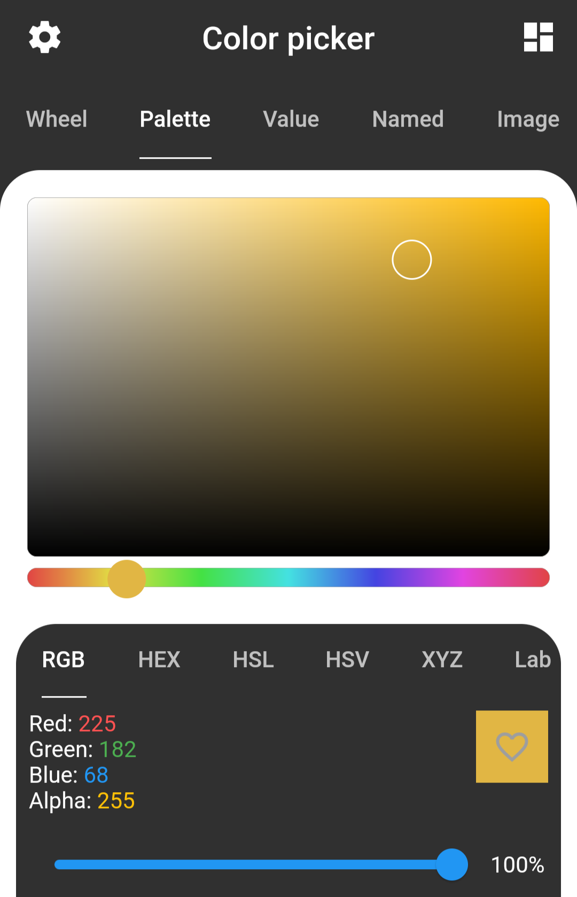
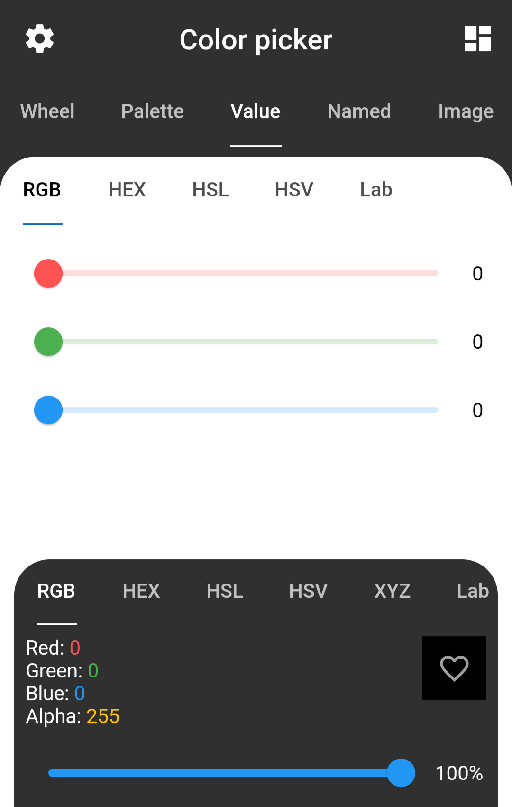
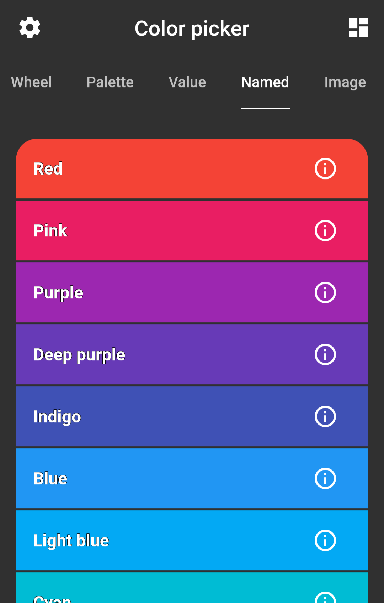
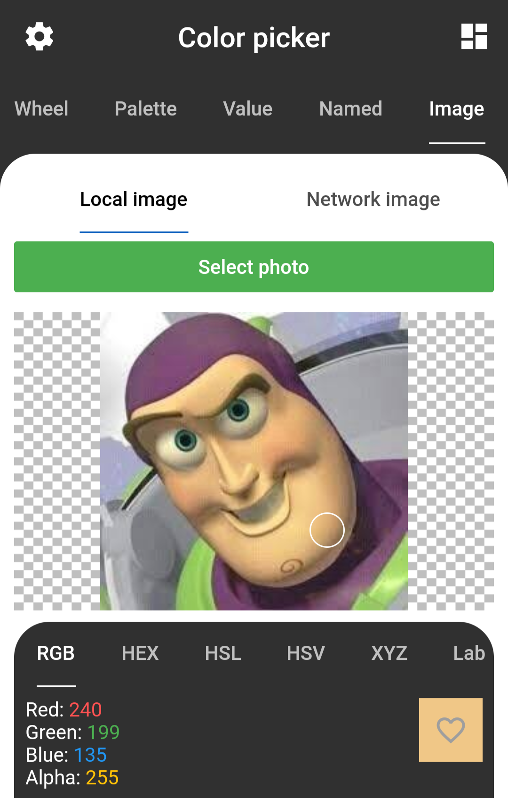
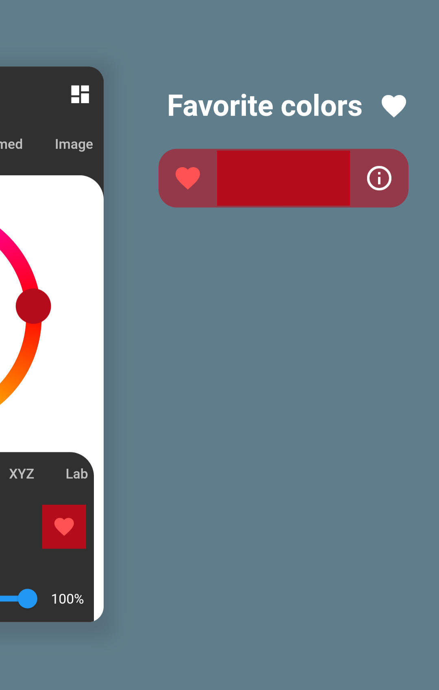
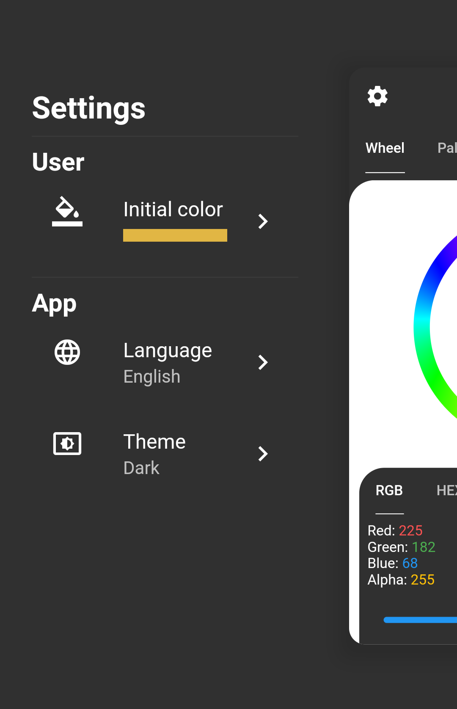

  <h1 align="center">Color Picker</h1>
  

    
    
  

  

    
  

An app made in Flutter to help people choose the colors they will use in their projects!

## Features

Pick a color from a picker wheel, palette, value, named and even from an image.\
Liked a color? Favorite it to use it later or copy it to clipboard.\
Is it too bright? Don't worry, use the dark theme.\

✔️ Resposive - The zoomed scaffold will expand in screens larger than 950px\
✔️ [Accessible](https://flutter.dev/docs/development/accessibility-and-localization/accessibility) - Includes tooltips and `Semantics` to accessibility\
✔️ [Internationalized](https://flutter.dev/docs/development/accessibility-and-localization/internationalization) - Includes support for English and Portuguese

### Color info

You can see a color information or parse with the following color spaces:

| Space  | See info | Parse | Copy |
| :----- | :------: | :---: | :--: |
| RGB    |    ✔️    |  ✔️   |  ✔️  |
| HEX    |    ✔️    |  ✔️   |  ✔️  |
| HSL    |    ✔️    |  ✔️   |  ✔️  |
| HSV    |    ✔️    |  ✔️   |      |
| Cielab |    ✔️    |  ✔️   |      |
| XYZ    |    ✔️    |       |      |

## Showcase

A brief showcase of the app. [Download](https://github.com/bdlukaa/color-picker/releases)

| Wheel Picker                                                  | Palette Picker                                                  |
| ------------------------------------------------------------- | --------------------------------------------------------------- |
|  |  |

| Value Picker                                                  | Named Picker                                                  |
| ------------------------------------------------------------- | ------------------------------------------------------------- |
|  |  |

| Image Picker                                                  | Favorite Colors                                                  |
| ------------------------------------------------------------- | ---------------------------------------------------------------- |
|  |  |

| Settings                                                  |
| --------------------------------------------------------- |
|  |

# Contribution

Feel free to [open an issue](https://github.com/bdlukaa/color-picker/issues/new) if you find an error or [make pull requests](https://github.com/bdlukaa/color-picker/pulls).
